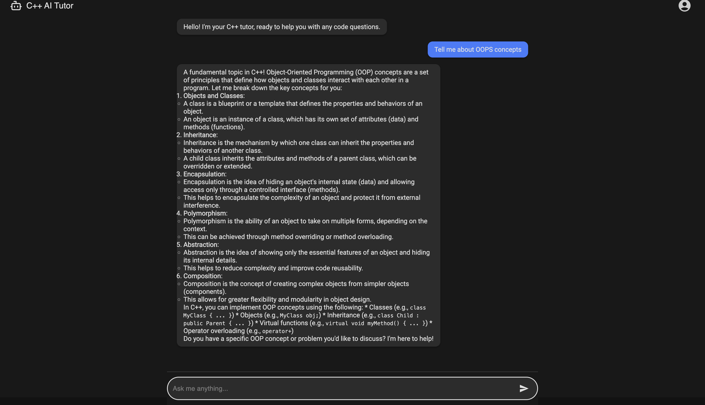
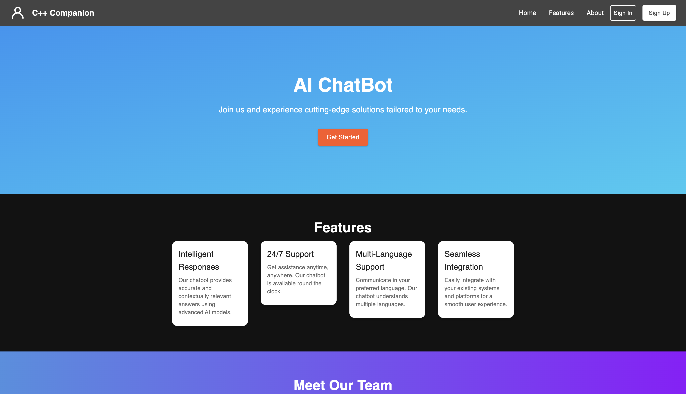
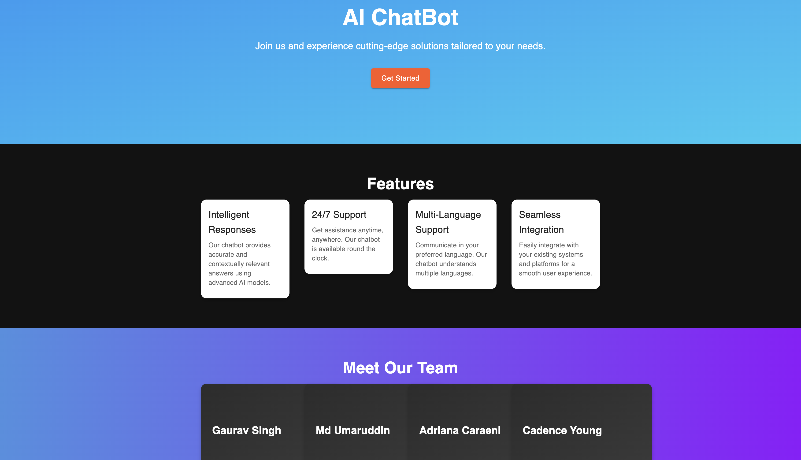
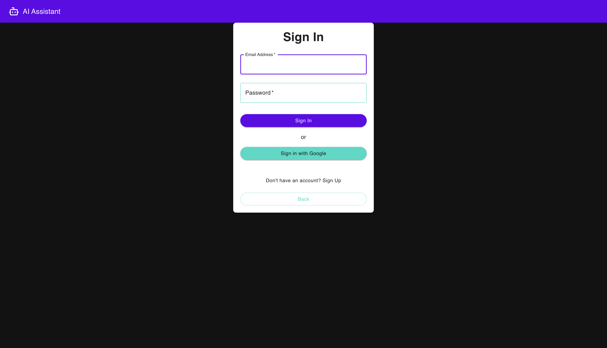
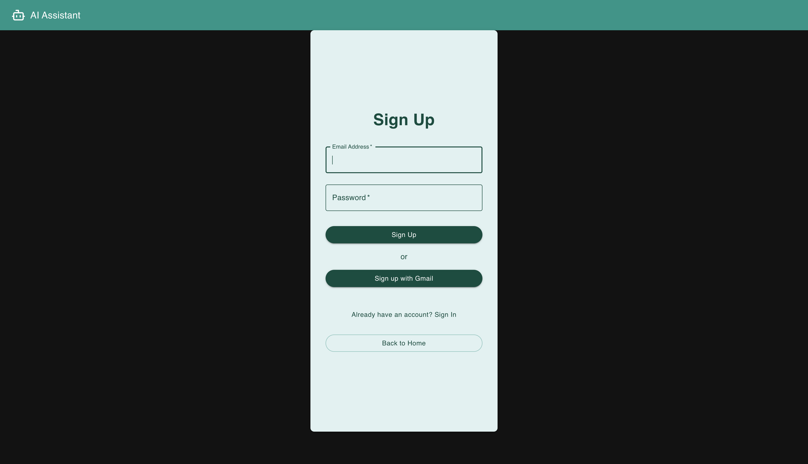

# AI-Chatbot

### Developed by:
- [**Gaurav Kumar Singh**] [Profile](https://github.com/gavksingh)
- [**Mohd Umar**] [Profile](https://github.com/genericlearner)
- [**Cadence Young**] [Profile](https://github.com/cadence-github-username)
- [**Adriana Caraeni**] [Profile](https://github.com/adriana-github-username)

## Project Overview


*Figure 5: Chatbot interaction with users regarding programming concepts.*

This AI-powered chatbot is designed to assist students in learning computer programming, with a primary focus on **C++**. The chatbot helps users by providing explanations, answering queries, and offering guidance on programming concepts, syntax, and problem-solving techniques. 


*Figure 1: Chatbot home screen.*



*Figure 2: Alternative view of the chatbot home screen.*


In addition to its core programming assistance, the chatbot supports **multiple languages**, allowing users to interact with the bot in various languages based on their preference. This feature ensures accessibility to a wider range of users worldwide.

## Key Features

- **C++ Programming Assistance**: The bot specializes in helping students learn C++, covering topics like data structures, algorithms, object-oriented programming, and more.
  
- **Interactive Q&A**: Students can ask questions about specific programming concepts, and the chatbot will provide detailed explanations and code snippets as needed.
  
- **Multi-language Support**: The chatbot allows users to switch between languages, making it easier for non-English speaking students to learn and understand programming concepts.

- **Firebase Authentication**: User authentication is handled through Firebase, ensuring secure access to the chatbot and personalized interactions for each user.


*Figure 3: User sign-in interface.*


*Figure 4: User sign-up interface.*

- **React and Next.js**: The front-end of the chatbot is built using React, providing a dynamic and interactive user interface, while Next.js powers the backend, delivering efficient server-side rendering and routing.

- **User-friendly Interface**: The chatbot is designed to be intuitive and easy to use, with clear prompts and guidance.

## Technology Stack

- **Frontend**: Built with **React** and **Next.js**, providing a fast and interactive UI/UX experience.
  
- **Backend**: Managed with **Next.js** to handle routing and API integration, allowing efficient communication between the chatbot and the server.

- **Authentication**: **Firebase Authentication** is used to provide secure login and personalized experiences for users.

- **Multi-language Support**: The chatbot leverages [insert translation technology, e.g., Google Translate API or AWS Translate] to offer multi-language support.

## Installation & Setup

1. **Clone the repository**:
   ```bash
   git clone https://github.com/your-repo-url/ai-chatbot
